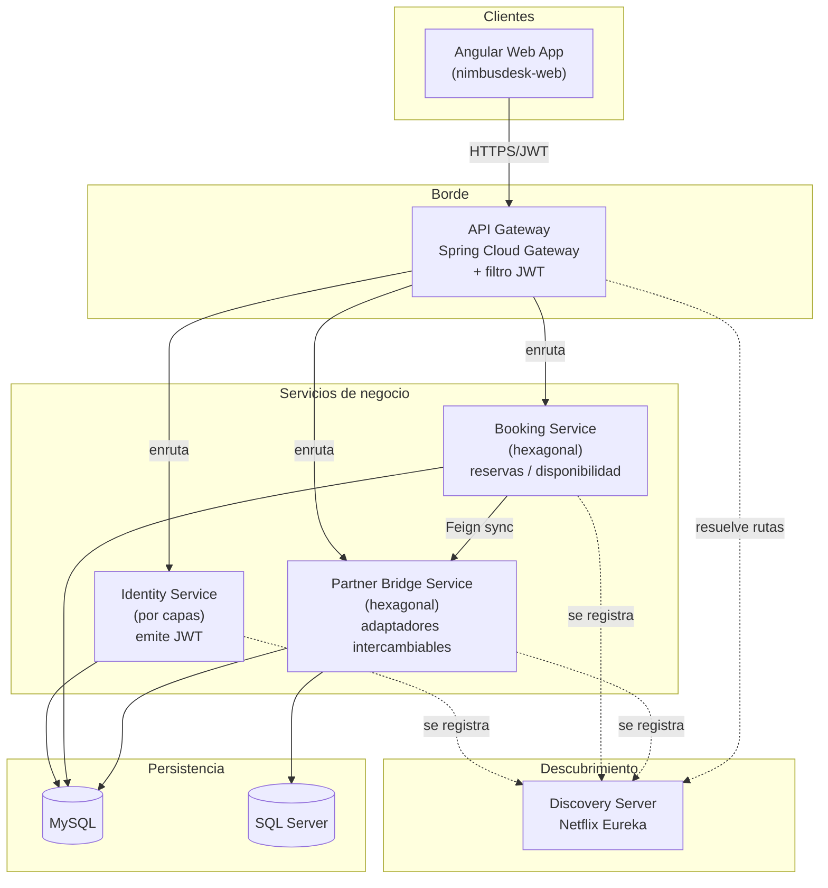

# NimbusDesk

**NimbusDesk** es una plataforma SaaS ficticia de reservas de salas y espacios de coworking para empresas. El caso de uso es inventado: existe únicamente como base para un portafolio técnico que demuestra microservicios + arquitectura hexagonal en Java/Spring.

Este repositorio (`nimbusdesk-infra`) es el punto de entrada del sistema: contiene la documentación de arquitectura, las decisiones de diseño (ADRs) y el `docker-compose` para levantar todo el ecosistema en local.

## Dos versiones, una narrativa

| | v1 — este set de repos | v2 — futuro |
|---|---|---|
| Objetivo | Reproducir fielmente una arquitectura de microservicios real de 2022, **incluyendo sus limitaciones** | Rediseñar el mismo sistema aplicando lo aprendido |
| Java | 17 | 21 |
| Comunicación entre servicios | Síncrona (Feign/REST) | Síncrona + eventos (mensajería) |
| Resiliencia | Ninguna (fiel al original) | Resilience4j (circuit breaker, retry) |
| Configuración | Local por servicio (fiel al original) | Config Server centralizado |
| Consistencia arquitectónica | Intencionalmente inconsistente (ver [ADR-0003](adr/0003-identity-service-arquitectura-por-capas.md)) | Hexagonal consistente en todos los servicios |
| Observabilidad | Ninguna | Tracing distribuido (OpenTelemetry) |

v1 no es "la versión mala": es la evidencia de una arquitectura que funcionó en producción, con las decisiones (y las concesiones) reales que eso implica. v2 es la demostración de criterio para evolucionarla.

## Repositorios (v1)

| Repo | Rol | Arquitectura interna |
|---|---|---|
| `nimbusdesk-infra` | Este repo: docs, ADRs, docker-compose | — |
| [`nimbusdesk-discovery-server`](../nimbusdesk-discovery-server) | Service registry (Netflix Eureka) | — |
| [`nimbusdesk-api-gateway`](../nimbusdesk-api-gateway) | Edge gateway: enrutamiento + validación JWT | Spring Cloud Gateway + filtros |
| [`nimbusdesk-identity-service`](../nimbusdesk-identity-service) | Autenticación y emisión de JWT | Por capas (controller/service/persistence) |
| [`nimbusdesk-booking-service`](../nimbusdesk-booking-service) | Núcleo de negocio: reservas, disponibilidad, precios | Hexagonal (domain/application/infrastructure) |
| [`nimbusdesk-partner-bridge-service`](../nimbusdesk-partner-bridge-service) | Integración con sistemas externos, mismo puerto con adaptadores intercambiables | Hexagonal |
| [`nimbusdesk-web`](../nimbusdesk-web) | Dashboard Angular de administración y reservas | — |

> `nimbusdesk-notification-service` (mensajería basada en eventos) queda fuera de v1 a propósito — es parte del roadmap de v2.

Ver el plan de trabajo completo en [ROADMAP.md](ROADMAP.md).

## Arquitectura (vista de contenedores)



## Cómo levantar el sistema en local

Cloná cada repo como hermano de este (`D:\Git\nimbusdesk-*`), y luego:

```bash
docker compose up -d
```

El `docker-compose.yml` de este repo levanta primero la infraestructura base (MySQL, SQL Server) y, a medida que cada servicio se construye, se van habilitando sus bloques correspondientes (ver comentarios en el archivo).

## Documentación

- [ROADMAP.md](ROADMAP.md) — plan de trabajo y orden de construcción
- [CONTRIBUTING.md](CONTRIBUTING.md) — convención de ramas y commits
- [docs/architecture/overview.md](docs/architecture/overview.md) — diagramas de contexto y contenedores
- [adr/](adr/) — decisiones de arquitectura registradas
