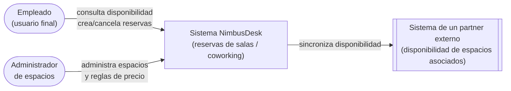
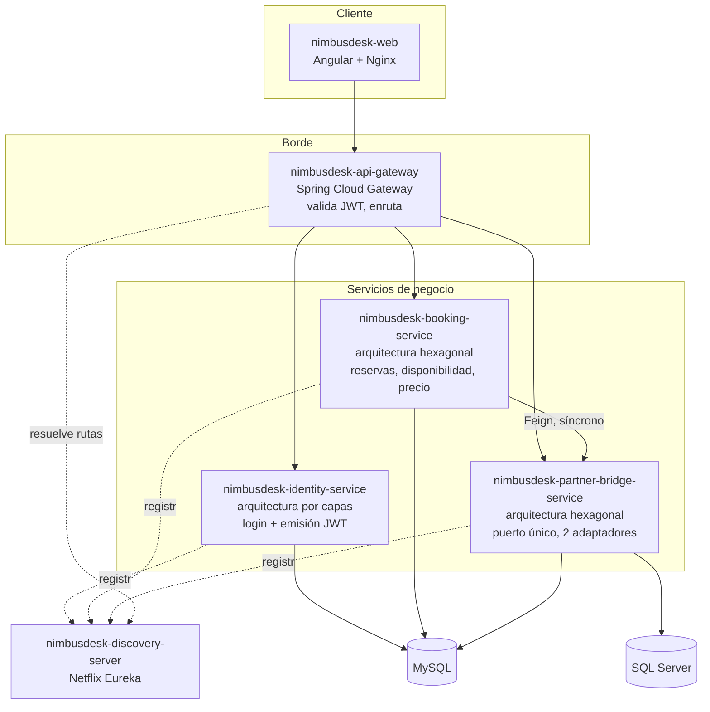
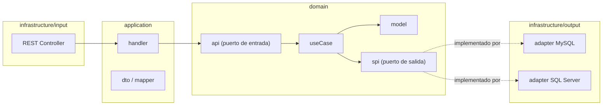

# Arquitectura — NimbusDesk v1

## Diagrama de contexto

Quiénes interactúan con el sistema y qué sistemas externos toca.

## Diagrama de contenedores

## Por qué dos estilos internos conviven en v1

`identity-service` usa capas clásicas (`controller` → `service` → `persistence`) mientras `booking-service` y `partner-bridge-service` usan hexagonal (`domain` → `application` → `infrastructure`). No es un descuido de este repo: es la reproducción fiel de una decisión real — un servicio de autenticación relativamente simple no siempre justifica el costo de puertos/adaptadores. El razonamiento completo está en [ADR-0003](../../adr/0003-identity-service-arquitectura-por-capas.md).

## Detalle interno de un servicio hexagonal (`booking-service` / `partner-bridge-service`)

El punto central de la demo: `domain/useCase` depende de la interfaz `domain/spi`, nunca de un adaptador concreto. En `partner-bridge-service` ese único puerto tiene dos implementaciones (MySQL y SQL Server) seleccionables por perfil de Spring — la prueba de que el dominio no sabe (ni le importa) contra qué motor de base de datos corre.
